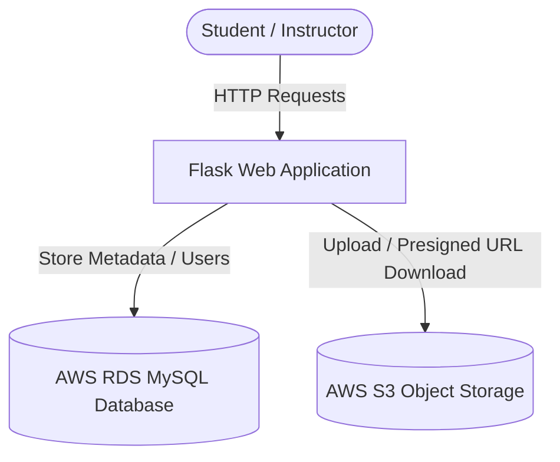

# Virtual Classroom Web Application

This repository contains a secure, cloud-integrated **Virtual Classroom** web application built with Python and Flask. The application demonstrates real-time integration with AWS cloud services, utilizing **Amazon RDS (MySQL)** for structured database storage and **Amazon S3** for secure course material object storage.

---

## 🏗️ Architecture & Component Overview

The application follows a standard three-tier architecture:



### 1. Presentation & Logic Tier (Flask)
- Built using **Flask (Python)** to serve dynamic web pages and handle RESTful routing.
- Supports role-based access flows for **Students** (registration, login, view dashboard, download files) and **Instructors** (instructor login, file upload).

### 2. Database Tier (AWS RDS MySQL)
- Managed MySQL instance hosted on **AWS RDS**.
- Stores structured persistent tables for student credentials and uploaded materials metadata.

### 3. Storage Tier (AWS S3)
- Stores files securely in an **Amazon S3 bucket** (`nandini-project-bucket-2026`).
- Uses **IAM Authentication** via `boto3` to securely upload objects.
- Uses **S3 Presigned URLs** with a 1-hour expiration time for file downloads, ensuring the bucket objects remain private and secure.

---

## 🗄️ Database Schema

The database `virtualclassroom` contains two main tables:

### 1. `users` Table
Stores registered student credentials.
* `id`: `INT AUTO_INCREMENT PRIMARY KEY`
* `username`: `VARCHAR(100)` (Unique student username)
* `password`: `VARCHAR(100)`

### 2. `materials` Table
Stores the registry of uploaded class files.
* `id`: `INT AUTO_INCREMENT PRIMARY KEY`
* `filename`: `VARCHAR(255)`

---

## 🔗 Route Map & API Endpoints

| Endpoint | Method | Role | Description |
| :--- | :--- | :--- | :--- |
| `/` | `GET` | Guest | Home landing page with navigation links. |
| `/register` | `GET`, `POST` | Guest | Registers a new student account in the RDS `users` table. |
| `/login` | `GET`, `POST` | Guest | Authenticates students against RDS database and redirects to dashboard. |
| `/dashboard` | `GET` | Student | Displays the list of available course materials fetched from RDS. |
| `/instructor` | `GET`, `POST` | Instructor | Logs in the instructor (default: `admin` / `admin123`). |
| `/upload` | `GET`, `POST` | Instructor | Allows uploading of new files. Uploads directly to S3 and inserts metadata into RDS. |
| `/download/<filename>`| `GET` | Student | Generates a 60-minute AWS S3 presigned URL and redirects the user to download. |
| `/logout` | `GET` | Student/Instructor| Terminates session and redirects to the landing page. |

---

## ⚙️ Installation & Local Setup

### Prerequisites
- Python 3.8+
- AWS CLI configured with valid credentials (`aws configure`)
- MySQL client libraries (optional, for manual DB queries)

### Step 1: Clone and Navigate
```bash
git clone https://github.com/Nandini2330/nandini_aws_prjct.git
cd nandini_aws_prjct
```

### Step 2: Set Up Virtual Environment
Create and activate a Python virtual environment to manage dependencies cleanly:
```bash
python3 -m venv venv
source venv/bin/activate
```

### Step 3: Install Dependencies
```bash
pip install -r requirements.txt
```

---

## 🚀 Running the Application

Start the development server using the virtual environment's python interpreter:
```bash
python app.py
```
The server will start running on: **`http://localhost:5000`**

---

## 🧪 Running Integration Tests

An automated test suite (`test_app.py`) is provided to verify the application flows end-to-end:
- **Scenario 1:** Registers a new student, logs in, and verifies access to the dashboard.
- **Scenario 2:** Logs in as instructor and uploads a file to S3.
- **Scenario 3:** Accesses the dashboard to verify the file is listed and requests a download, validating the generated S3 presigned URL.

Run the test suite using:
```bash
python test_app.py
```
